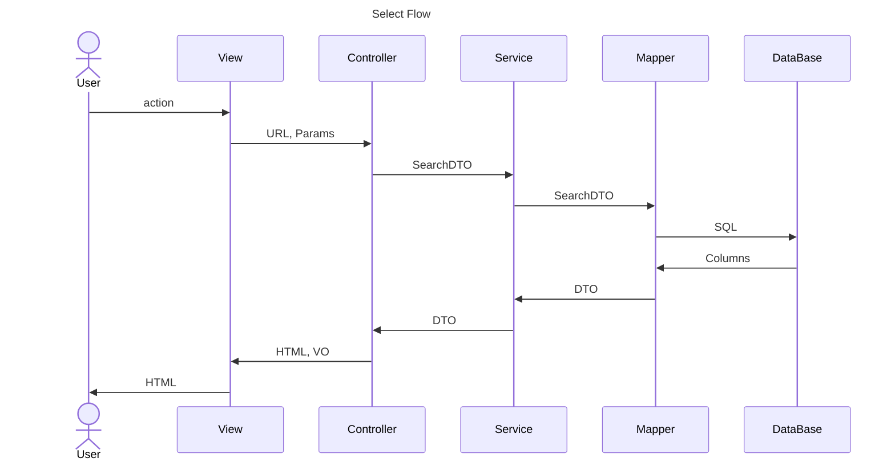
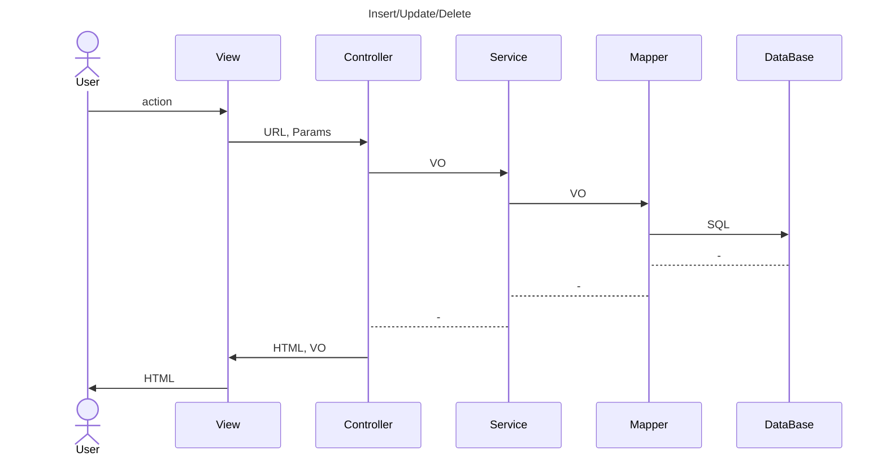

# EgovBoot-4.1.2
전자정부프레임워크 공통컴포넌트 4.1.2 Spring Boot 버전

## 프로젝트 구조

### src/main/java
```text
egovframework
   ㄴ ablyr --------------------------------- Abstract Layer, 계층형 구조로 구성
   ㄴ com ------------------------------------ 공통컴포넌트
      ㄴ cmm --------------------------------- 공통컴포넌트 범용
      ㄴ utl --------------------------------- 공통컴포넌트 유틸
   ㄴ conf ----------------------------------- 설정파일
   ㄴ main ----------------------------------- EgovBootApplication.java
   ㄴ util ----------------------------------- 유틸리티
```
### Architecture





# CKEditor

https://www.codingfactory.net/13253

# 제외한 라이브러리

- ajaxtags-resources: JSP Ajax 관련 Tag
- xbean: XML 스키마로 Bean 생성
- javaparser-core: Java 1.8까지만 지원 가능
- taglibs-standart-impl: JSTL

# Plugin 수정

> maven-war-plugin -> maven-jar-plugin  
> cargo-maven3-plugin 주석

